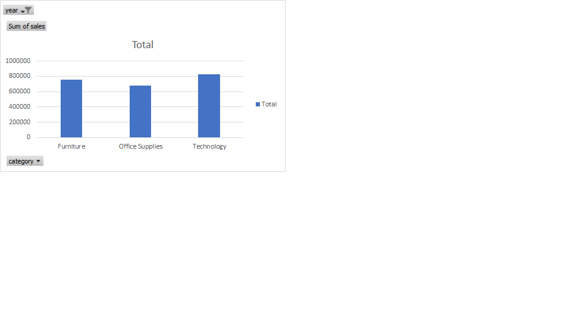

# Lawpat_Tech_Hub

### Project Title: E Commerce Sales Analytics

### Project Overview
---
This project focuses on analyzing e-commerce sales data to uncover meaningful insights that can support business decision making and improve overall performance. The analysis explores key areas such as sales trends, customer purchassing behaviour, product performance, and revenue distribution accrossdifferent regions and time periods.

### Data Sources
---
Using data analysis techniques, the project identifies patterns and relationships within the dataset, helping to highlight high performing products, peak sales period, and potential areas for growth. The goal is to transform raw data into actionable insights that can guide strategic planning, optimize marketting efforts and enhance customer satisfaction.

### Tools Used
---
- Microsoft excel [download here](https://www.microsoft.com)
  1. For Data Cleaning
  2. For Analysis
  3. For Data Visualization
- SQL - Structured Query Language
- Github For Portfolio Building

### Data Cleaning And Preparation
---
In the initial phase of the data cleaning and preparation, we perform the following actions;
1. Data Filtering and Sorting
2. Removing Duplicates
3. Handling Missing Data

### Exploratory Data Analysis
---
EDA involves summarizing key variables and visualizing data to uncover trends, anomalies and insights;
1. What is the overall total sales
2. What is the average order value
3. What are the products on peak sales

### Data Analysis
---
The result of the analysis were presented using clear visualizations and summaries, making it easier to interpret findings and communicate insights effectively. SQL queries and Excel functions were used to perform aggregations, filtering and calculations.
```SQL
Select * from table
Where condition = TRUE
```
### Data Visualization



